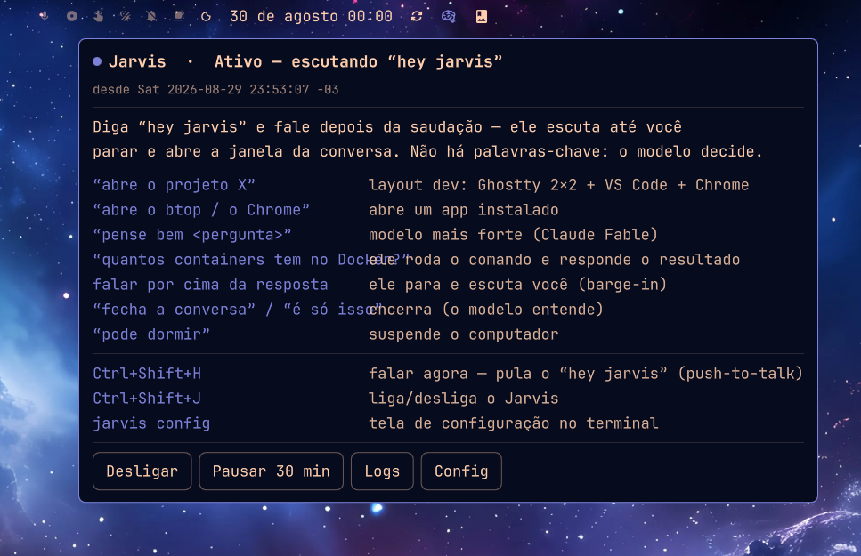
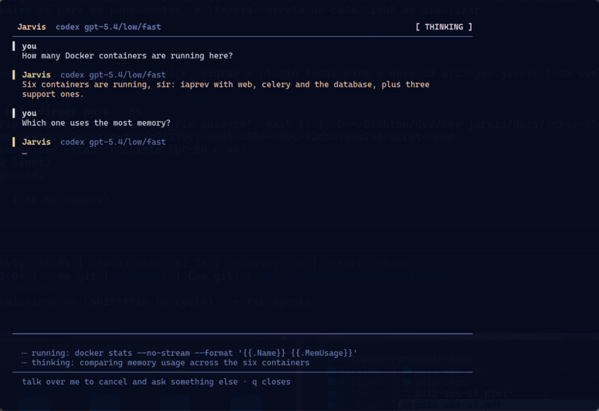
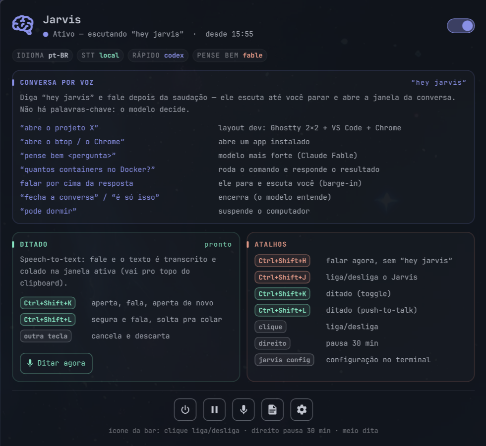
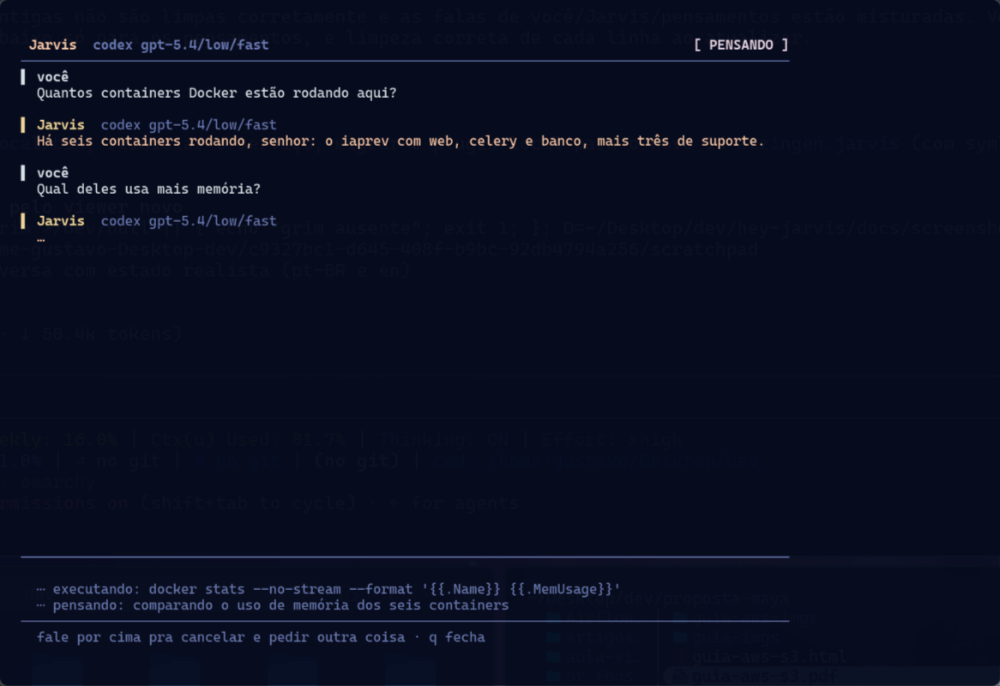
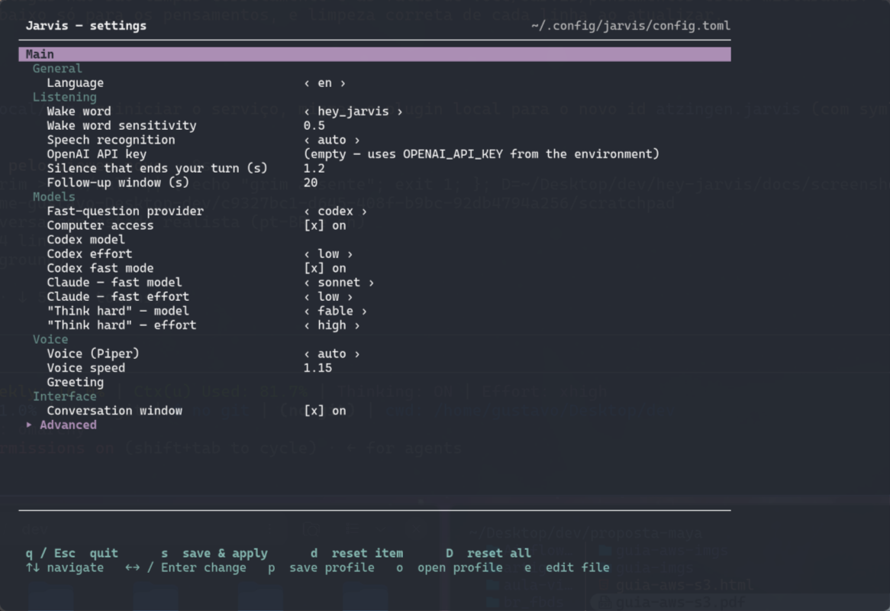
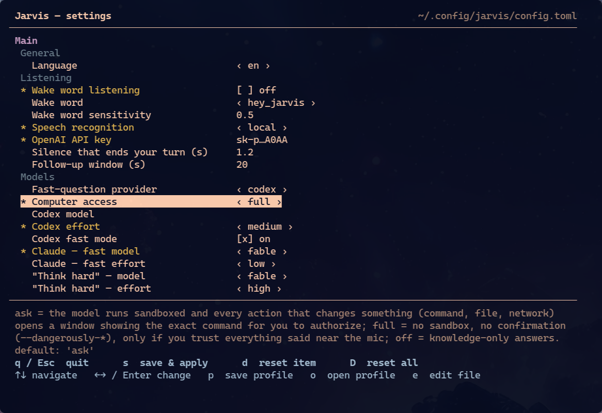

# Jarvis — talk to your Omarchy desktop

> **Say "hey jarvis". Ask anything. Watch it happen.** A local-first voice assistant for Arch Linux + Hyprland that understands what you mean, runs it on your machine, and talks back — in English or Brazilian Portuguese. Ships as an Omarchy shell plugin.



## Your computer, one sentence away

You are deep in a terminal and need a second project open. You want to know how many containers are still running before you close the lid. You have a paragraph in your head and no patience to type it. With Jarvis you just say it:

- *"hey jarvis, let's work on iaprev"* — a 2×2 terminal grid, VS Code and a browser open on that project.
- *"how many Docker containers are running?"* — it runs `docker ps` and tells you the number.
- *"think hard: Postgres or SQLite for this?"* — the question goes to the strongest model and comes back as a spoken, reasoned answer.
- **`Ctrl+Shift+K`**, talk, `Ctrl+Shift+K` again — your words are transcribed and pasted into whatever window has focus. Speech-to-text for every app, no extra daemon.

There are **no keywords to memorize**. Everything you say goes to a model that already has access to your machine — the same Codex CLI and Claude Code you use for coding — so it can answer by *doing*, not by guessing.

## Why you'll like it

| | |
|---|---|
| **Private by default** | Wake word, voice capture and (with a GPU) transcription run **locally**. Nothing leaves the machine until you wake it — and when you do, only your words go to the model you chose. |
| **Feels like a conversation** | It listens until you stop talking, keeps the context of the last exchanges, opens a follow-up window after every answer and lets you **talk over it** to interrupt. |
| **Actually does things** | Opens projects and apps, suspends the machine, runs commands and reads their output. Two model tiers: fast (Codex) for everyday questions, "think hard" (Claude Fable) when it matters. |
| **Dictation everywhere** | The same microphone and Whisper model double as a system-wide speech-to-text: toggle or push-to-talk, live transcript, optional local polish for punctuation. |
| **At home in Omarchy — and beyond** | A brain icon in your bar with a hover panel (voice guide, keybindings, one-click controls) that follows your theme and language. The exact same panel also opens as a standalone window (`jarvis app`, or "Jarvis" in the launcher) on any Linux. |
| **Yours to tune** | `jarvis config` — a terminal settings screen with profiles, or a scriptable CLI. Wake word, silence timing, models, voices, STT backend: everything is a key in one `config.toml`. |

## Try it in two minutes

```bash
omarchy plugin add https://github.com/Atzingen/hey-jarvis --enable   # the bar widget
# hover the icon → Install (sets up the voice service), or: bash install.sh
```

Then say **"hey jarvis"** and ask for something. Add the [keybindings](#keybindings) for push-to-talk and dictation, and you are done. The panel also opens as a standalone window — search for **Jarvis** in your launcher or run `jarvis app` (works outside Omarchy too).



---

# Reference

Everything below is the detailed documentation: how a conversation flows, every setting, the CLI, the architecture and the troubleshooting notes.

## Table of contents

- [Features](#features)
- [How a conversation works](#how-a-conversation-works)
- [Install](#install)
- [The bar widget](#the-bar-widget)
- [The conversation window](#the-conversation-window)
- [Settings](#settings) · [Main](#main-settings) · [Advanced](#advanced-settings) · [Profiles](#profiles)
- [Dictation](#dictation)
- [Speech-to-text: local or OpenAI](#speech-to-text-local-or-openai)
- [Models and machine access](#models-and-machine-access)
- [Language](#language)
- [The `jarvis` CLI](#the-jarvis-cli)
- [Keybindings](#keybindings)
- [Architecture](#architecture)
- [Repository layout](#repository-layout)
- [Requirements](#requirements)
- [Troubleshooting](#troubleshooting)
- [Security model](#security-model)
- [License](#license)

---

## Features

| | |
|---|---|
| **Wake word, always on** | openWakeWord (`hey jarvis`, ~2 % CPU). Nothing leaves the machine until you wake it. Push-to-talk keybinding too. |
| **Natural turns** | Speech is captured by a VAD: it records while you talk and stops after ~1.2 s of silence — no fixed recording window. |
| **Conversation, not commands** | After every answer a 20 s follow-up window opens; just keep talking. Previous exchanges go to the model as context. |
| **Barge-in** | Talk over Jarvis while it thinks or speaks: it stops, listens, and chains what you said. An energy gate keeps it from interrupting itself through the speakers. |
| **The model decides** | No keyword parsing. The model receives an *action protocol* (open project, open app, sleep, end conversation) and emits markers the launcher executes; anything else about the machine it does itself. |
| **Machine access, with your consent** | Answers about your system come from real commands — but by default (`system_access = "ask"`) the model runs sandboxed and every action that changes something opens a window showing the **exact command** for you to allow or deny. `full` (no sandbox, no prompts) and `off` (knowledge-only) are opt-in. |
| **Two model tiers** | Fast path: Codex (low effort, fast tier). Say **"think hard …"** (*"pense bem …"*) for Claude Fable / high effort. |
| **Live window** | A floating window shows the phase (listening / recording / thinking / answering / your turn, with countdown), the conversation with speaker labels, live speech-to-text, and what the model is doing while you wait. |
| **Long tasks don't die** | If a model call exceeds its deadline it is handed to a separate scratch terminal that keeps running and shows the answer. |
| **Speech-to-text, your choice** | Local faster-whisper (large-v3-turbo on CUDA, small on CPU) or OpenAI Realtime (`gpt-live-transcribe`) with live provisional text. Automatic fallback. |
| **Settings UI** | `jarvis config` — a terminal screen with everything: main options up top, advanced folded, profiles, defaults. Also a scriptable CLI. |
| **Bilingual** | en / pt-BR: voice, recognition, prompts, window, settings screen, bar panel. |
| **Dictation** | `Ctrl+Shift+K`: speak, press again, the text is pasted into the active window (and lands on top of the clipboard history). Live transcript + audio meter in the window; optional local polish (Ollama) for punctuation and hesitations. Same mic, same STT, same window as the assistant. |
| **Bar widget** | Omarchy shell plugin: brain icon in the theme accent when active, hover panel in cards — state + on/off switch, config chips, voice guide, dictation (with a start/stop button and live recording state), keybindings, icon actions (power, pause, dictate, logs, settings, install). |

---

## How a conversation works

```
"hey jarvis"  ──►  greeting  ──►  you talk … 1.2 s silence  ──►  speech-to-text
                                                                       │
                     ┌─────────────────────────────────────────────────┘
                     ▼
              model (Codex, or Claude for "think hard")
              gets: system prompt + action protocol + machine notes + last exchanges
                     │
        ┌────────────┼───────────────────────────────┐
        ▼            ▼                               ▼
   spoken answer   markers → launcher executes     anything else about the machine
   (Piper TTS)     <<ABRIR_PROJETO: x>> dev layout  → the model runs it itself
                   <<ABRIR_APP: x>>     launch app
                   <<DORMIR>>           suspend
                   <<FIM>>              end conversation
                     │
                     ▼
        20 s follow-up window — keep talking, or say goodbye, or stay silent
```

Things you can say (any phrasing works — these are examples):

| You say | What happens |
|---|---|
| "how many Docker containers are running?" | the model runs `docker ps` and answers with the number |
| "open a terminal on workspace 1" | the model does it (`omarchy-launch-terminal`, `hyprctl dispatch …`) and confirms |
| "let's work on hey-jarvis" / "abre o projeto iaprev" | `<<ABRIR_PROJETO>>` → 2×2 Ghostty grid + VS Code + Chrome for `~/Desktop/dev/<project>` |
| "open btop" / "abre o Chrome" | `<<ABRIR_APP>>` → launches the installed app (TUIs float like Omarchy's own) |
| "think hard: should I use Postgres or SQLite here?" | Claude Fable, high effort |
| "go to sleep" / "pode dormir" | `<<DORMIR>>` → `systemctl suspend` |
| "that's all, thanks" / "fecha essa conversa" | `<<FIM>>` → goodbye, conversation closes |
| *talk while it is answering* | it stops and listens (barge-in) |
| **"pause"** / **"fim"** (single word) | the only two local hard commands: mute / end |

Data-heavy answers (weather for the week, rankings) are spoken as a summary; the full detail — after a `---` line in the model's reply — is shown only in the window.

---

## Install

**As an Omarchy plugin** (Omarchy 4+, recommended):

```bash
omarchy plugin add https://github.com/Atzingen/hey-jarvis --enable
```

This installs the bar widget. Hover the icon → **Install** runs `install.sh` in a terminal, which sets up the voice service:

1. system packages if missing (`portaudio`, `pipewire-pulse`, a terminal);
2. a Python environment — reuses a conda env named `voice` if you have one, otherwise a venv at `~/.local/share/jarvis/venv` — with `requirements.txt` (+ CUDA wheels when an NVIDIA GPU is detected);
3. Piper voices for en-US and pt-BR into `~/.local/share/piper-voices`;
4. the scripts into `~/.local/bin`;
5. the `voice-launcher.service` user unit, enabled and started.

**Manually** (any Hyprland setup):

```bash
git clone https://github.com/Atzingen/hey-jarvis.git && cd hey-jarvis
bash install.sh
```

After a `git pull`, `bash install.sh --update` re-copies the scripts and restarts the service.

### Uninstall

```bash
bash install.sh --uninstall            # stops/disables the service, removes scripts, unit and the venv it created
bash install.sh --uninstall --purge    # also removes ~/.config/jarvis (settings, profiles) and the Piper voices
omarchy plugin remove atzingen.jarvis  # removes the bar widget
```

Nothing is written outside `~/.local/bin`, `~/.local/share/jarvis`, `~/.local/share/piper-voices`, `~/.config/jarvis`, `~/.local/share/applications/jarvis.desktop` and `~/.config/systemd/user/voice-launcher.service`. Jarvis never edits your Hyprland or Omarchy configuration; the keybindings and the bar-accent hook are opt-in snippets you add yourself.

You also need the model CLIs you want to use: [Codex CLI](https://github.com/openai/codex) (`codex login`) for the fast path and/or [Claude Code](https://docs.claude.com/en/docs/claude-code) for "think hard" (or set `quick_provider = "claude"` to use Claude for everything).

---

## The bar widget


The hover panel is the screenshot at the top of this page.

The icon shows the service state — **󰧑** on (in the theme accent color), **󱍎** paused, **󱍄** off, **󰍬** (urgent color) while a dictation is being recorded. Left-click toggles, right-click pauses for 30 minutes, middle-click starts/stops a dictation. Hovering opens the panel, organized in cards:

- **Hero** — state line (on / paused / off / recording, with "since HH:MM" or "back in N min") and an on/off switch (or **Install** when the service isn't set up yet);
- **Chips** — what it is running with right now: language, STT provider, quick model, "think hard" model;
- **Voice conversation** — the spoken-command guide;
- **Dictation** — the speech-to-text keys (`Ctrl+Shift+K` toggle, `Ctrl+Shift+L` push-to-talk, any other key cancels), the live state (ready / recording / Jarvis off) and a **Dictate now / Stop and paste** button;
- **Keybindings** — every shortcut as a key cap, plus the mouse actions on the icon;
- **Footer** — icon actions: power, pause 30 min, dictate, logs, settings.

Section colors derive from the theme accent (voice = accent, dictation and keys = the accent rotated on the hue wheel), so the panel follows every Omarchy theme. Panel texts follow the configured language.

### The same panel as an app — on any Linux

The exact same panel opens as a standalone window: **`jarvis app`**, or search for **Jarvis** in your application launcher (`install.sh` adds a desktop entry). It is the same `app/qs/PanelContent.qml` the bar popup renders — same cards, same colors, same **Dictate now / Stop and paste** button — hosted by whatever is available:

1. **quickshell** (Omarchy / Arch): renders the QML directly (`app/qs/shell.qml`);
2. **PySide6** (Ubuntu, Fedora, anywhere Qt runs — `pip install PySide6`): the same QML via `bin/jarvis-panel.py`;
3. **no Qt at all**: a terminal (curses) rendition of the panel, pure stdlib (`bin/jarvis-app.py`).

Outside the Omarchy shell there is no theme to follow, so the standalone window uses a fixed dark palette (`app/qs/Commons/`).



## The conversation window



A floating terminal opens the moment a conversation starts and stays until it ends:

- **badge** with the current phase — LISTENING / RECORDING / TRANSCRIBING / THINKING / ANSWERING / YOUR TURN (with a countdown) / IN TERMINAL;
- the **conversation** as separate blocks per speaker (`▌ you` / `▌ Jarvis` with the model label), most recent at the bottom;
- while recording with the OpenAI backend, **your words appear as you speak** (provisional text);
- a fixed **activity strip** at the bottom: what the model is doing right now (`running: docker ps …`, `thinking: …`), so waiting never feels dead;
- **hints** for the phase (talk over me, ask to end, `q` closes).

`q` or `Esc` in the window ends the conversation.

---

## Settings



Everything is configurable, three ways:

- **`jarvis config`** (also the **Settings** button in the bar panel): a terminal screen. *Main* options on top, *Advanced* collapsed below (Enter expands). `←/→`/Enter cycles options or edits a value, `d` resets one key, `D` resets everything, `s` saves and restarts the service, `p` saves the current values as a named profile, `o` loads a profile, `e` opens the file in `$EDITOR`, `q`/Esc quits (asks to save if there are pending changes). Changed values are marked `*`; the footer explains the selected item and its default.
- **CLI**: `jarvis config show | get <key> | set <key> <value> | reset [<key>] | path` — validated (choices, min/max), secrets masked.
- **The file**: `~/.config/jarvis/config.toml` (mode 0600). Only the keys you changed are written; each is documented inline. Anything missing uses the built-in default.

### Main settings

| Key | Default | What |
|---|---|---|
| `language` | `en` | `en` or `pt-BR` — voice, recognition language, prompts, window and settings texts |
| `wake_word_enabled` | `true` | `false` = hotkeys-only mode: the mic stays closed while idle; push-to-talk (`Ctrl+Shift+H`) and dictation (`Ctrl+Shift+K/L`) still open it on demand. `jarvis wake` toggles it live |
| `wake_word` | `hey_jarvis` | openWakeWord model: `hey_jarvis`, `alexa`, `hey_mycroft`, `hey_rhasspy` |
| `wake_threshold` | `0.5` | wake score threshold (lower = more sensitive) |
| `stt_provider` | `auto` | `auto` / `local` / `openai` — see [Speech-to-text](#speech-to-text-local-or-openai) |
| `openai_api_key` | `""` | key for the `openai` STT backend (empty = `OPENAI_API_KEY` env) |
| `end_silence_seconds` | `1.2` | continuous silence that ends your turn — raise it if it cuts you off |
| `followup_seconds` | `20.0` | listening window after each answer, no wake word needed |
| `quick_provider` | `codex` | fast path: `codex` (Codex CLI) or `claude` (Claude Code CLI) |
| `system_access` | `ask` | `ask` = sandboxed, each consequential action needs your OK in a window showing the exact command; `full` = no sandbox / no approvals (`--dangerously-*`); `off` = knowledge-only. See [Models and machine access](#models-and-machine-access) |
| `codex_model` / `codex_effort` | `""` / `low` | Codex model (empty = CLI default) and reasoning effort |
| `codex_fast` | `true` | Codex fast mode (`service_tier=fast`) |
| `claude_quick_model` / `claude_quick_effort` | `sonnet` / `low` | fast path when `quick_provider = "claude"` |
| `deep_model` / `deep_effort` | `fable` / `high` | "think hard" (always Claude Code CLI): `fable`, `opus`, `sonnet`, `haiku` |
| `voice` | `auto` | Piper voice; `auto` = the language default (`en_US-lessac-medium` / `pt_BR-faber-medium`) |
| `voice_length_scale` | `1.15` | speech speed (>1 slower) |
| `greeting` | `""` | spoken on wake; empty = language default (*"What shall we work on, sir?"*) |
| `window_enabled` | `true` | the conversation window |
| `dictation_window` | `true` | live transcript + audio meter while dictating |
| `dictation_output` | `paste` | `paste` (clipboard + Ctrl+V into the active window) / `type` / `clipboard` |
| `dictation_polish` / `dictation_polish_model` | `false` / `gemma3:4b` | optional Ollama pass for punctuation/hesitations |

### Advanced settings

| Key | Default | What |
|---|---|---|
| `whisper_model` | `auto` | `auto` = `large-v3-turbo` on GPU, `small` on CPU; or any faster-whisper size |
| `whisper_device` | `auto` | `auto` / `cuda` / `cpu` |
| `openai_stt_model` | `gpt-live-transcribe` | or `gpt-realtime-whisper`, `gpt-4o-transcribe`, `gpt-4o-mini-transcribe` |
| `vad_speech_threshold` | `0.5` | silero probability to count a frame as speech |
| `first_speech_wait_seconds` | `6.0` | how long to wait for you to start after the greeting |
| `max_utterance_seconds` | `45.0` | hard cap per utterance |
| `preroll_chunks` | `6` | 80 ms chunks kept from before speech onset |
| `max_history_exchanges` | `4` | previous exchanges sent as context |
| `handoff_seconds_quick` / `_deep` | `45` / `180` | after this the model call moves to a scratch terminal (it keeps running) |
| `system_prompt` | `""` | style instructions; empty = language default (edit in `$EDITOR`) |
| `barge_min_rms` | `0.012` | energy floor for your speech to count as an interruption |
| `tts_bleed_factor` | `1.5` | speech must exceed N× the TTS bleed measured on the mic |
| `barge_tts_warmup_frames` | `4` | frames calibrating the bleed at the start of each TTS |
| `barge_hits_tts` / `barge_hits_idle` | `3/4` / `2/3` | N of the last M frames with speech to trigger |
| `interrupt_threshold_boost` | `0.2` | extra wake threshold during the answer (TTS false positives) |
| `barge_debug` | `true` | log `[barge] rms/gate/vad` once a second while busy |
| `dictation_max_seconds` | `600` | recording cap for a dictation |
| `dev_dir` | `~/Desktop/dev` | where "open project X" looks |
| `layout_script` | `~/.local/bin/dev-layout` | run as `<script> <project>` |

### Profiles

`p` in the settings screen saves the current values as `~/.config/jarvis/profiles/<name>.toml`; `o` loads one (then `s` to apply). Useful for "quiet office" vs "home speakers", or en vs pt-BR setups.

---

## Dictation

Jarvis doubles as a speech-to-text tool for any window — the same microphone, STT backend, hotwords and window, no second daemon or second Whisper copy in VRAM.

- **Toggle** (`Ctrl+Shift+K`): press, talk, press again → the text is transcribed, optionally polished, copied to the clipboard (top of Omarchy's clipboard history) and **pasted into the active window** (`Ctrl+V`, or `Ctrl+Shift+V` when the active window is a terminal). While recording, any other key cancels.
- **Push-to-talk** (`Ctrl+Shift+L`): hold to talk, release to paste.
- The window shows the **live transcript** (with the OpenAI backend the words appear as you speak) and a scrolling **audio level meter**, then the phase: TRANSCRIBING → POLISHING → PASTED.
- If Jarvis is in a conversation when you press the key, the conversation yields the microphone to dictation.

Settings (`jarvis config` → Dictation): `dictation_output` = `paste` / `type` (types the text with `wtype`) / `clipboard` (copy only); `dictation_polish` (off by default) runs the transcript through a local Ollama model (`dictation_polish_model`, default `gemma3:4b`) that only fixes punctuation and removes hesitations — it never rewrites, and falls back to the raw text if the output looks wrong or Ollama is unavailable; `dictation_window` shows/hides the window; `dictation_max_seconds` (advanced) caps a recording.

CLI: `jarvis dictate toggle | start | stop | cancel` — this is what the keybindings call (`integrations/hypr-bindings.lua`). Requires `wl-clipboard` and `wtype`.

---

## Speech-to-text: local or OpenAI

`stt_provider` picks how your speech becomes text. Both backends sit behind the same interface (`bin/jarvis_stt.py`), so the rest of the pipeline doesn't care.

| Provider | What it does | When |
|---|---|---|
| `local` | faster-whisper on the machine. NVIDIA GPU: `large-v3-turbo` fp16 — ~0.1 s for 10 s of speech on an RTX 4090. CPU: `small` int8 — ~1.5 s on a desktop, 3–5 s on a laptop. No key, no network, offline. Project and app names are passed as `hotwords`. | default; always the fallback |
| `openai` | OpenAI Realtime API (`gpt-live-transcribe`, WebSocket): audio streams while you talk, **provisional text shows live in the window**, final transcript on commit. Project names as `keywords`. If the API fails (no network, bad key, no credits, timeout) the buffered audio is transcribed locally — you never lose an utterance. ≈ US$ 0.017 per spoken minute. | machines without a GPU, or when you want live text |
| `auto` | GPU present → `local`; no GPU and a key → `openai`; else `local` on CPU. | default value |

```bash
jarvis config set openai_api_key sk-...      # or export OPENAI_API_KEY in the service environment
jarvis config set stt_provider openai
voice-launcher --stt local                   # one-off override for a run
```

The API session is opened the moment Jarvis starts listening, so the handshake overlaps with you starting to speak; only speech is sent (no silence, no greeting).

---

## Models and machine access

- **Fast path** — `quick_provider`: Codex CLI (`codex exec --json --ephemeral`, effort `codex_effort`, `service_tier=fast` when `codex_fast`) or Claude Code (`claude -p --output-format stream-json`).
- **"Think hard"** — say *"think hard …"* / *"pense bem …"*: always Claude Code with `deep_model` / `deep_effort`.
- **`system_access`** — how much the model may touch the machine. The model is told it is on your computer and must answer with *results*, not commands, and gets a short **machine cheat-sheet** (Omarchy 4: `omarchy-launch-terminal`, `systemd-run --user … -- <app>` to launch without blocking, `hyprctl dispatch 'hl.dsp.focus({ workspace = "N" })'`).

  | Mode | Claude Code | Codex CLI |
  |---|---|---|
  | **`ask`** (default) | `claude -p --permission-mode default --permission-prompt-tool mcp__jarvis__approve`: no bypass. Read-only tools and read-only commands (`ls`, `cat`, `docker ps`…) run directly; **everything else** (a command that writes, a file edit, network, launching an app) is routed to `bin/jarvis_consent_mcp.py`, which opens the **authorization window** with the exact tool input. The CLI runs in an empty working directory (`~/.local/share/jarvis/workdir`) so reading files elsewhere also asks. | `codex exec --sandbox read-only -c approval_policy=never`: Codex's own sandbox (no writes, no network, no Docker socket). For anything beyond that the model must *propose* `<<RODAR: exact shell command>>`; Jarvis shows it in the authorization window, runs it only if you allow, and hands the output back for the spoken answer (at most 2 rounds, 3 commands each). |
  | `full` | `--dangerously-skip-permissions` | `--dangerously-bypass-approvals-and-sandbox` |
  | `off` | `--tools ""` (no tool use) | `--sandbox read-only`, no `<<RODAR>>` protocol |

  The **authorization window** (`bin/jarvis-consent.py`, a floating terminal) shows what you asked, the exact command or tool input, the directory, and three keys: `y` allow once, `a` allow everything until this question is answered, `n`/Esc deny. No answer within 90 s = denied; talking over Jarvis or closing the conversation denies and closes any pending request. Jarvis says *"I need your authorization, sir"* when a request opens, and the conversation window switches to the **AUTHORIZATION** phase. `allow everything` lives only in the process of that one question — nothing is ever remembered.

  `full` is the 2.1 behaviour: the voice transcript (and anything the model reads) can drive machine actions with no confirmation. Enable it only if you trust everything that is said near the microphone: `jarvis config set system_access full`. Existing configs with `system_access = true/false` are read as `full`/`off`.

  The mode is a choice field in the settings screen (`jarvis config`, or the Settings button on the bar panel) — no command needed — and the current value is shown as the **ACCESS** chip on the bar panel and in `jarvis app`.

  
- Both CLIs run in **streaming JSON mode**; `bin/jarvis_events.py` turns their events (commands run, reasoning, messages) into the live activity lines in the window and in the scratch terminal.
- Every subprocess Jarvis spawns — apps, windows, the model CLI — is launched in its own systemd scope (`uwsm-app` / `systemd-run --scope`), outside the service cgroup. Restarting `voice-launcher.service` never kills what it opened.

---

## Language

`language = "en"` or `"pt-BR"` changes, at once: the Piper voice (with `voice = "auto"`), the speech-recognition language (Whisper / OpenAI), the system prompt and action protocol sent to the model, the fixed spoken phrases (greeting, "thinking, sir", "I didn't catch that"…), the conversation window, the settings screen and the bar panel. The repository default is English; `jarvis config set language pt-BR` switches to Portuguese.

Custom `greeting`, `voice` or `system_prompt` values override the language defaults.

---

## The `jarvis` CLI

| Command | Effect |
|---|---|
| `jarvis on` / `off` / `toggle` / `toggle-notify` | control the service (`toggle-notify` also sends a notification) |
| `jarvis pause <dur>` / `pause-notify [dur]` | stop now, start again after `30s`, `45m`, `1h`, `2h30m`… |
| `jarvis wake on\|off\|toggle\|status` | just the wake-word listening: `off` keeps the service up with the **microphone closed** — push-to-talk and dictation still work (takes effect instantly, persists as `wake_word_enabled`) |
| `jarvis status` / `status-short` | JSON for bars (`{text, alt, class, tooltip}`, `alt` = on/off/paused) / `on`\|`off` |
| `jarvis app` | the panel as a window — quickshell → PySide6 → terminal fallback (also the **Jarvis** entry in the app launcher) |
| `jarvis log` | `journalctl --user -u voice-launcher -f` |
| `jarvis config` | settings screen (floating terminal) |
| `jarvis config show \| get \| set \| reset \| path` | scriptable settings |

Runtime overrides: `voice-launcher --test` (dry run: no layouts, no suspend), `--stt local|openai|auto`, `--whisper-model <size>`, `--wake-threshold 0.6`.

---

## Keybindings

`~/.config/hypr/bindings.lua` (Omarchy 4, Lua):

```lua
o.bind("CTRL + SHIFT + J", "Toggle Jarvis", "jarvis toggle-notify")
o.bind("CTRL + SHIFT + H", "Jarvis: push-to-talk", "systemctl --user kill -s SIGUSR1 voice-launcher.service")
-- dictation (Ctrl+Shift+K toggle, Ctrl+Shift+L push-to-talk, any other key cancels): see integrations/hypr-bindings.lua
```

Push-to-talk (`SIGUSR1`) starts a conversation as if the wake word had fired — handy during a call.

---

## Architecture

```
mic 16 kHz, 80 ms chunks ─► openWakeWord ─► (wake)
                                              │
                    ┌─────────────────────────┴──────────────────────────┐
                    │  conversation loop (voice-launcher.py)              │
                    │   greeting (Piper) → VAD capture → STT session      │
                    │   → model (Codex/Claude, streaming JSON)            │
                    │     ask mode: consent window per action             │
                    │   → actions (markers) → TTS → follow-up window      │
                    │  BargeInListener: wake word or speech over TTS      │
                    └───┬──────────────┬──────────────┬──────────────────┘
                        ▼              ▼              ▼
                 jarvis_stt.py   jarvis_events.py  $XDG_RUNTIME_DIR/jarvis-state.json ─► jarvis-window.py
                 local whisper   CLI events →                                (floating viewer)
                 or OpenAI RT    activity lines
```

- One thread reads the microphone at a time. The wake loop hands the stream to the conversation; during the busy phase the `BargeInListener` owns it.
- Barge-in gate: the TTS bleed level is calibrated on the first frames of each utterance and only ever updated from frames *below* the gate, so it never learns from your voice.
- The window is a plain file watcher: the launcher writes state, the viewer renders. No IPC to break.
- Consent works the same way (`bin/jarvis_consent.py`): a request is a JSON file in `$XDG_RUNTIME_DIR/jarvis-consent/`, the authorization window writes the decision next to it. For Claude the requester is `jarvis_consent_mcp.py` (a 100-line stdio MCP server that Claude Code uses as its permission prompt tool); for Codex it is the launcher's `<<RODAR>>` broker.
- Every model call runs in a named systemd scope (`jarvis-model-*.scope`). Cancelling a question stops the whole scope — the CLI, the commands it spawned, the consent server — and denies any open request.
- Config is a schema (`bin/jarvis_config.py: SETTINGS`) with defaults, labels, help, choices and limits — the TUI, the CLI and the TOML writer are all generated from it.

---

## Repository layout

```
hey-jarvis/
├── manifest.json               Omarchy shell plugin manifest (id atzingen.jarvis)
├── BarWidget.qml               the bar widget: icon + hover popup hosting PanelContent
├── app/qs/                     PanelContent.qml (THE panel, shared by popup and app),
│                               StatusPoller.qml, shell.qml (quickshell), main.qml (PySide6), qs shims
├── install.sh                  idempotent installer (env, voices, scripts, service)
├── bin/
│   ├── voice-launcher          wrapper (venv or conda env `voice`)
│   ├── voice-launcher.py       main loop: wake → capture → STT → model → actions → TTS
│   ├── jarvis                  CLI: on/off/pause/status/app/log/config
│   ├── jarvis_config.py        settings schema, defaults, TOML, profiles, CLI
│   ├── jarvis-config.py        settings screen (curses)
│   ├── jarvis_i18n.py          en / pt-BR strings, prompts, action protocol
│   ├── jarvis_stt.py           speech-to-text backends (local whisper / OpenAI Realtime)
│   ├── jarvis_events.py        streaming events of the model CLIs → activity lines
│   ├── jarvis_dictate.py       dictation: polish (Ollama), paste into the active window, level meter
│   ├── jarvis_consent.py       consent requests/decisions (files in $XDG_RUNTIME_DIR/jarvis-consent)
│   ├── jarvis-consent.py       authorization window: exact command, y / a / n
│   ├── jarvis_consent_mcp.py   stdio MCP server = Claude Code's permission prompt tool (ask mode)
│   ├── jarvis-window.py        conversation window viewer
│   ├── jarvis-panel.py         `jarvis app` via PySide6 (same QML, for non-Omarchy distros)
│   ├── jarvis-app.py           `jarvis app` fallback: the panel as a terminal (curses) screen
│   └── dev-layout              Hyprland dev layout (2×2 Ghostty + VS Code + Chrome)
├── systemd/voice-launcher.service
├── integrations/
│   ├── hypr-bindings.lua       keybinding snippet (Lua + classic)
│   ├── jarvis.desktop          desktop entry template (Jarvis in the app launcher)
│   └── waybar/                 waybar module (for non-Omarchy Hyprland setups)
├── docs/                       screenshots, bar-active-accent hook
├── requirements.txt            Python deps
├── requirements-gpu.txt        optional cuBLAS/cuDNN wheels for CUDA whisper
└── LICENSE                     MIT
```

---

## Requirements

- Arch Linux with Hyprland — developed on Omarchy 4 (the bar widget needs the Omarchy shell; the voice service works on any Hyprland).
- Python 3.11+, PipeWire, PortAudio, `wl-clipboard` + `wtype` (dictation paste), a terminal (`ghostty` by default), a microphone.
- Codex CLI and/or Claude Code CLI, logged in.
- Optional: NVIDIA GPU for local `large-v3-turbo` transcription; an OpenAI API key for realtime transcription.

Python packages: see `requirements.txt` (openwakeword, faster-whisper, piper-tts, sounddevice, websockets…). Tested with Python 3.11.

---

## Troubleshooting

| Symptom | Check |
|---|---|
| Nothing happens on "hey jarvis" | `jarvis log` — is the service running? `wake_threshold` too high? default mic device (`pactl info`)? |
| It cuts me off mid-sentence | raise `end_silence_seconds` (1.5–2.0) |
| It interrupts itself while speaking | raise `tts_bleed_factor` / `barge_min_rms`; `barge_debug` prints the measured levels in the log |
| It doesn't stop when I talk over it | lower `barge_min_rms`; check `[barge]` lines in `jarvis log` for your speech level |
| `openai indisponível … fallback local` in the log | key, credits (`credit_balance_exhausted`) or network — answers still come from local whisper |
| Whisper on CPU although I have a GPU | `pip install -r requirements-gpu.txt` in the env; `jarvis log` shows `whisper …/cuda` |
| Answers say "I can't access…" / "not authorized" | `system_access` is `off`, you denied (or let time out) the authorization window, or the CLI isn't logged in |
| An "authorization" window pops up | that's `system_access = "ask"` (default): the model wants to run what the window shows — `y` allows, `n` denies. Set `full` to stop being asked (see [Models and machine access](#models-and-machine-access)) |
| Active bar icons are red | that's the Omarchy theme default; see the note in [The bar widget](#the-bar-widget) |

---

## Security model

What runs where, what `install.sh` writes, which network endpoints are ever
contacted, and how the model's machine access is gated (consent by default,
`full` opt-in) — one page, written for reviewers: [SECURITY.md](SECURITY.md).

## License

MIT — see `LICENSE`.

### Third-party components

Installed by `install.sh` into the Python environment or `~/.local/share`, each under its own license:

| Component | Role | License |
|---|---|---|
| [openWakeWord](https://github.com/dscripka/openWakeWord) + `hey_jarvis` model | wake word | Apache-2.0 |
| [faster-whisper](https://github.com/SYSTRAN/faster-whisper) / [CTranslate2](https://github.com/OpenNMT/CTranslate2) | local speech-to-text | MIT |
| Whisper models (OpenAI, via Systran conversions) | STT weights | MIT |
| [Silero VAD](https://github.com/snakers4/silero-vad) (bundled in faster-whisper) | voice activity detection | MIT |
| [Piper](https://github.com/rhasspy/piper) (`piper-tts`) | text-to-speech, called as a subprocess | GPL-3.0-or-later |
| Piper voices `pt_BR-faber-medium`, `en_US-lessac-medium` | TTS voices | see each voice's `MODEL_CARD` on Hugging Face (`rhasspy/piper-voices`) |
| [sounddevice](https://github.com/spatialaudio/python-sounddevice) / PortAudio | microphone | MIT / MIT |
| [onnxruntime](https://github.com/microsoft/onnxruntime) | ONNX inference | MIT |
| [websockets](https://github.com/python-websockets/websockets) | OpenAI Realtime client | BSD-3-Clause |
| NumPy | audio buffers | BSD-3-Clause |
| NVIDIA cuBLAS / cuDNN wheels (optional, `requirements-gpu.txt`) | CUDA for local Whisper | NVIDIA EULA |

Codex CLI and Claude Code CLI are not bundled — you install and log into them yourself, under their own terms. Using the OpenAI Realtime API or the model CLIs sends your speech/questions to those providers.
