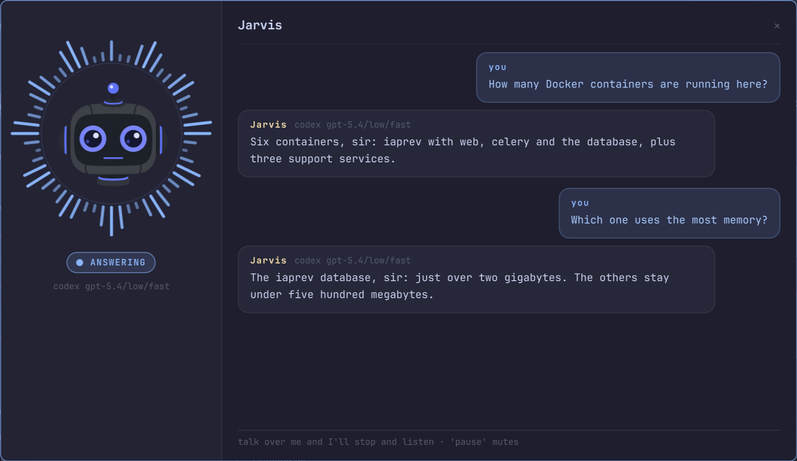
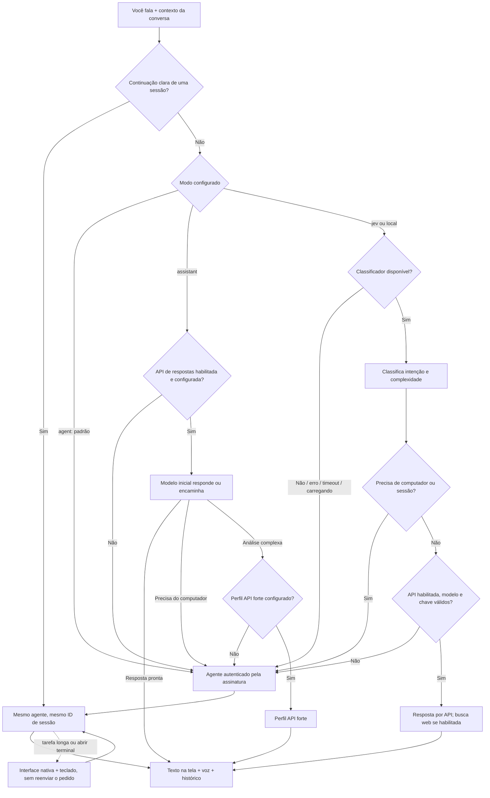

# Jarvis — converse com seu computador

Diga **“hey jarvis”**, faça uma pergunta ou peça uma ação. O Jarvis transcreve sua fala, responde em voz alta e mantém a conversa na tela. Também oferece ditado para qualquer aplicativo, integração com a barra do Omarchy e suporte opcional ao robô Picoh.

**Uma assinatura do Claude Code ou do Codex é suficiente para o agente.** Chave de API, Jev e classificador local são opcionais. Instalações novas e configurações antigas continuam começando em `routing_mode = "agent"`, com respostas por API desabilitadas.



[Instalação](#instalação) · [Fluxo](#como-um-pedido-é-atendido) · [Roteamento](#roteamento-opcional) · [Configuração](#como-configurar) · [Terminal](#conversa-no-terminal) · [Ditado](#ditado-e-atalhos) · [Diagnóstico](#diagnóstico) · [Referência detalhada em inglês](docs/reference.en.md)

## O que você pode fazer

| Você pede | O Jarvis faz |
|---|---|
| “Explique a diferença entre RAM e armazenamento.” | Responde pela assinatura ou pela API que você habilitou. |
| “Qual é a previsão do tempo para amanhã?” | Usa busca web na rota API habilitada, ou encaminha ao agente e às ferramentas permitidas. |
| “Quantos containers estão rodando aqui?” | Encaminha ao agente, respeitando a configuração de acesso ao computador. |
| “Abra o projeto X.” | Abre o ambiente do projeto: terminais, editor e navegador. |
| “Continue de onde parou.” | Mantém a sessão identificada do agente. |
| Aperta `Ctrl+Shift+K`, fala e aperta novamente | Transcreve e entrega o texto para colar no aplicativo ativo. |

O Jarvis fala português do Brasil e inglês. A captura usa detecção de fala, com encerramento após silêncio; depois da resposta, a janela de continuação permite falar novamente sem repetir a palavra-chave. Falar por cima interrompe a resposta. A voz é sintetizada localmente pelo Piper.

## Instalação

Você precisa de Linux, microfone, áudio funcionando e **um** agente autenticado: [Codex CLI](https://github.com/openai/codex) ou [Claude Code](https://code.claude.com/docs/en/overview). Faça o login desse CLI com sua assinatura antes de usar o Jarvis. A API de respostas é uma contratação/configuração separada.

No Omarchy, adicione o painel à barra:

```bash
omarchy plugin add https://github.com/Atzingen/hey-jarvis --enable
```

Clique no ícone e em **Instalar** para instalar o serviço de voz. Adicionar o plugin sozinho instala o painel.

Para instalar a partir do repositório:

```bash
git clone https://github.com/Atzingen/hey-jarvis.git
cd hey-jarvis
bash install.sh
```

O instalador prepara o ambiente Python de voz, os modelos de reconhecimento, as vozes Piper, os scripts, a interface e o serviço de usuário `voice-launcher.service`. As dependências Python e os downloads de voz têm versões/verificações fixadas. Fora do Omarchy, instale os pacotes de sistema que ele indicar e execute novamente.

**A instalação normal não baixa o classificador de roteamento, não instala seu PyTorch e não ativa respostas pagas por API.** Uma GPU pode acelerar o reconhecimento de fala existente; o classificador opcional descrito abaixo roda somente na CPU.

Escolha o agente e o idioma:

```bash
jarvis config set language pt-BR
jarvis config set quick_provider codex   # ou claude
jarvis config
jarvis talk
```

A tela `jarvis config` salva e reinicia o serviço quando necessário. Depois de editar o TOML ou usar `config set` pelo terminal, aplique as alterações com:

```bash
systemctl --user restart voice-launcher.service
```

Para atualizar, após obter as mudanças do repositório, execute `bash install.sh --update`. Esse comando reaplica os arquivos e dependências da instalação normal e reinicia o serviço.

## Como um pedido é atendido


```mermaid
flowchart TD
    A[Você fala + contexto da conversa] --> B{Continuação clara de uma sessão?}
    B -- Sim --> S[Mesmo agente, mesmo ID de sessão]
    B -- Não --> C{Modo configurado}
    C -- agent: padrão --> G[Agente autenticado pela assinatura]
    C -- assistant --> I{API de respostas habilitada e configurada?}
    I -- Não --> G
    I -- Sim --> M[Modelo inicial responde ou encaminha]
    M -- Resposta pronta --> R[Texto na tela + voz + histórico]
    M -- Precisa do computador --> G
    M -- Análise complexa --> J{Perfil API forte configurado?}
    J -- Não --> G
    J -- Sim --> K[Perfil API forte]
    K --> R
    C -- jev ou local --> D{Classificador disponível?}
    D -- Não / erro / timeout / carregando --> G
    D -- Sim --> E[Classifica intenção e complexidade]
    E --> F{Precisa de computador ou sessão?}
    F -- Sim --> G
    F -- Não --> H{API habilitada, modelo e chave válidos?}
    H -- Não --> G
    H -- Sim --> P[Resposta por API; busca web se habilitada]
    P --> R
    G --> S
    S --> R
    S -. tarefa longa ou abrir terminal .-> T[Interface nativa + teclado, sem reenviar o pedido]
    T --> S
```

O diagrama mostra as decisões **antes de executar**. Se uma execução já começou e a conexão cair, o Jarvis mantém o ID e tenta consultar a mesma sessão. Quando não consegue confirmar o resultado, informa a incerteza. **Ele não dispara uma segunda execução para compensar uma resposta perdida.**

Uma consulta atual depende de ferramentas de busca disponíveis. Quando a rota API não oferece busca, o encaminhamento é para o agente; as permissões desse agente continuam valendo. `system_access = "off"` não ganha acesso à internet ou ao computador por causa do roteador.

## Roteamento opcional

| `routing_mode` | Como decide | O que exige | Se faltar a dependência |
|---|---|---|---|
| **`agent` — padrão** | Envia diretamente ao agente escolhido. | Codex **ou** Claude autenticado. | Informa o problema do CLI/login; não depende de outro fornecedor. |
| `assistant` | Um modelo inicial por API responde diretamente ou pede encaminhamento. | API de respostas explicitamente habilitada, modelo e chave. | Usa o agente por assinatura. |
| `jev` | O Jev classifica o pedido e o nível de complexidade. | Chave do Jev/TypeSafe. | Usa o agente por assinatura. |
| `local` | Um classificador opcional decide na CPU. | Instalação separada do GLiNER2.5-multi-Decide. | Usa o agente enquanto o classificador carrega, falha ou está ausente. |

**O Jev é um classificador.** Ele não substitui o modelo que responde, não executa comandos e não escolhe nomes de modelos arbitrários. Sem uma API de respostas habilitada, a classificação continua levando ao agente da assinatura. A mesma regra vale para o classificador local.

**`assistant` é a alternativa sem Jev:** a primeira chamada à API já pode produzir a resposta. Se precisar de ferramentas do computador, entrega o pedido original e o contexto ao agente. Se existir um perfil API mais forte, permite uma escalada para ele; não cria uma cadeia sem fim de classificações.

O modo `agent` ignora os classificadores. Não importa seus modelos, não inicia workers locais nem consulta Jev/API de respostas. Ter uma chave OpenAI para transcrição ou narração **não habilita** a nova rota de respostas.

A janela mostra o modelo que atendeu **cada resposta**, com uma linha discreta do caminho escolhido: por exemplo, `Jev → busca web → API` ou `Jev → computador → Agente · assinatura`. Enquanto classifica, mostra que está escolhendo a rota. Se houver fallback, a mesma linha registra a falha e o encaminhamento para a assinatura. O histórico mantém o modelo e a rota de cada mensagem, mesmo quando respostas de tarefas longas chegam depois.

### Escolha de modelo e esforço

O roteador classifica a complexidade como baixa, média ou alta. Baixa/média usam o perfil normal. Alta pode usar o perfil forte que você configurar. Sem perfil forte, mantém o atual.

| Perfil | Modelo/esforço |
|---|---|
| Agente normal | `codex_model` + `codex_effort`, ou `claude_quick_model` + `claude_quick_effort` |
| Agente forte | `agent_strong_model` + `agent_strong_effort`, do **mesmo provedor** |
| API normal | `api_model` + `api_effort` |
| API forte | `api_strong_model` + `api_strong_effort` |

Use identificadores e níveis de esforço aceitos pelo modelo da sua conta. O Jarvis não ativa um modelo pago apenas porque descobriu uma chave.

**“Pense bem” e “think hard” agora são texto comum.** Essas frases não trocam de provedor nem ativam um modo especial. As antigas chaves `deep_model`, `deep_effort`, `handoff_seconds_deep` e `narration_interval_deep` continuam legíveis nos arquivos/perfis para permitir reversão, mas saíram dos controles ativos.

## Como configurar

Abra `jarvis config`. O grupo **Roteamento** reúne modo, API opcional, chave Jev e perfis fortes. As chaves ficam em `~/.config/jarvis/config.toml`, com permissão `0600`; campos secretos são mascarados na interface e em `config show`.

### Só assinatura, sem chaves de API

```toml
routing_mode = "agent"
api_provider = "none"
quick_provider = "codex"       # ou "claude"
agent_session_mode = "auto"
```

Esse é o comportamento de fábrica e o de configurações antigas que não contêm as novas chaves. Provedor, modelo, esforço e prioridade já salvos são preservados.

### Jev decide; a assinatura continua disponível

```toml
routing_mode = "jev"
api_provider = "none"
quick_provider = "codex"
```

Preencha `jev_api_key` na configuração. Também é possível fornecer `JEV_API_KEY` no ambiente do processo do Jarvis. Sem chave válida, o pedido segue ao agente. A configuração acima **não exige chave OpenAI**.

Para permitir respostas diretas por API, configure também:

```toml
api_provider = "openai"
api_model = "<modelo disponível na sua conta>"
api_effort = ""                # vazio: não envia parâmetro de esforço
api_web_search = true
```

Substitua o marcador do modelo e preencha `openai_api_key` na configuração, ou disponibilize `OPENAI_API_KEY` ao serviço. O opt-in que autoriza a rota é `api_provider = "openai"` junto com um modelo preenchido. Uma variável exportada em um terminal não aparece automaticamente em um serviço systemd já iniciado.

### Modelo inicial por API, sem Jev

Use a configuração de API acima e altere:

```toml
routing_mode = "assistant"
```

O modelo inicial responde quando consegue resolver o pedido em texto/busca pública. Necessidade de arquivos, aplicativos, comandos ou sites autenticados leva ao agente. `api_strong_model` é opcional.

### Classificador local, somente CPU

Essa opção é **experimental**. Ele classifica o pedido; não gera a resposta e não transforma o Jarvis em um assistente inteiramente local.

```bash
jarvis router install-local
jarvis config set routing_mode local
systemctl --user restart voice-launcher.service
```

O instalador opcional usa **Python 3.11 em Linux x86_64**, ambiente próprio em `~/.local/share/jarvis/router-local`, dependências fixadas com hashes e revisão fixa do modelo. Se necessário, indique o interpretador:

```bash
JARVIS_ROUTER_PYTHON=/caminho/para/python3.11 jarvis router install-local
```

O worker usa PyTorch CPU, bloqueia CUDA e carrega somente os arquivos já baixados. A instalação é explícita; uma fala nunca dispara download. Enquanto o modelo está frio, o pedido segue imediatamente ao agente. Depois de `local_router_idle_seconds` sem uso, o processo sai e libera a memória.

Veja as [evidências de validação](docs/routing-validation.md) para resultado, latência, consumo em disco e limitações da avaliação em português. Falhas de classificação não ampliam permissões: a rota API não executa ações textuais.

### Limites e reversão

| Chave | Padrão | Efeito |
|---|---|---|
| `router_timeout_seconds` | `5.0` | Prazo da classificação Jev/local; depois usa o agente. |
| `api_timeout_seconds` | `30.0` | Prazo da resposta API; uma execução incerta não é repetida. |
| `local_router_idle_seconds` | `300` | Inatividade até descarregar o classificador. |
| `handoff_seconds_quick` | `45` | Quando abrir o terminal de uma tarefa longa. |
| `handoff_max_minutes` | `30` | Prazo máximo de um turno; não é o tempo de vida de uma sessão ociosa. |
| `agent_session_mode` | `auto` | Sessão nativa quando suportada; `legacy` mantém o executor de compatibilidade. |

Para voltar ao caminho direto e ao executor anterior:

```bash
jarvis config set routing_mode agent
jarvis config set api_provider none
jarvis config set agent_session_mode legacy
systemctl --user restart voice-launcher.service
```

Perfis de configuração continuam disponíveis na tela de configuração. A [referência completa](docs/reference.en.md#settings) descreve as opções de áudio, voz, narração, interface e interrupção.

## Conversa no terminal

Tarefas do agente podem começar em uma sessão persistente. Ao demorar, ou ao clicar em **Abrir terminal**, o Jarvis abre um terminal normal com a interface do CLI e entrada de teclado. A janela mostra se o atendimento usa uma sessão interativa ou o modo de compatibilidade.

- **Codex:** app-server local, login da assinatura e TUI conectada ao mesmo ID. Esse canal local não é a API paga de respostas.
- **Claude:** sessão nativa em background e `attach` do ID exato, com um canal tmux privado para integrar a voz. Com o terminal anexado, o teclado tem a entrada; **`Ctrl+B`, depois `D`** desanexa e libera os pedidos de voz que estiverem na fila. Fechar a janela também desanexa.
- **Continuação:** novas mensagens pertencem à sessão identificada, com diretório e política de acesso conferidos. Não é usado `--last`, nem reenviado o pedido original ao abrir uma janela.
- **Resultado nas sessões nativas:** a conclusão real atualiza o histórico da conversa aberta, inclusive depois de abrir o terminal. A indicação “continua no terminal” não entra como resposta do modelo. O visualizador legado conserva seu comportamento anterior.
- **Compatibilidade:** se o CLI não oferecer as capacidades necessárias, o executor anterior é escolhido antes de enviar o pedido. Seu visualizador de progresso continua identificado como compatibilidade.

A integração nativa foi desenvolvida com Codex CLI `0.156.1` e Claude Code `2.1.280`. Claude também precisa de `tmux`; o terminal gráfico usa Alacritty. Versões/capacidades incompatíveis mantêm o caminho anterior.

Uma continuação mantém o perfil da sessão. No Claude, um pedido independente que selecionar outro modelo/esforço começa uma nova sessão nativa com o contexto recente; a sessão anterior continua identificável. No Codex, o perfil pode ser aplicado por turno. Quando o pedido menciona um único projeto real pelo nome em `dev_dir`, esse diretório é usado; nomes ambíguos ou links não selecionam outro diretório automaticamente.

```bash
jarvis session status <id-do-jarvis>
jarvis session open <id-do-jarvis>
jarvis session stop <id-do-jarvis>
```

Os registros ficam privados em `~/.local/share/jarvis/sessions`. O ID do Jarvis aparece no estado da conversa e em `jarvis router status`. Encerrar uma conversa por voz com “fim” desvincula a próxima conversa; uma tarefa já entregue ao terminal continua lá.

## Acesso ao computador

| `system_access` | Comportamento |
|---|---|
| **`ask` — padrão** | O modelo não tem shell/leitura/escrita próprios. Comandos, inclusive leituras, passam pela ferramenta de consentimento e mostram o comando exato. |
| `off` | Sem ferramentas do computador. Responde com as informações disponíveis. |
| `full` | Ferramentas do agente com as opções de acesso total já usadas pelo Jarvis. |

O roteador não muda essa escolha. Perfis fortes também não ganham permissões adicionais. Nas sessões persistentes, “permitir o resto desta pergunta” pertence ao turno atual, sem virar uma permissão para toda a conversa. O cancelamento interrompe também um comando autorizado em andamento.

Respostas por API são texto: marcadores como `<<ABRIR_APP: ...>>` ou `<<DORMIR>>` não são executados quando vêm dessa rota. Mais detalhes em [SECURITY.md](SECURITY.md).

## Ditado e atalhos

| Atalho | Função |
|---|---|
| `Ctrl+Shift+J` | Chama o Jarvis como a palavra-chave; liga o serviço se necessário. |
| `Ctrl+Shift+H` | Também chama o Jarvis. |
| `Ctrl+Alt+Shift+J` | Liga/desliga apenas a escuta da palavra-chave. |
| `Ctrl+Shift+K` | Começa/termina o ditado. |
| `Ctrl+Shift+L` | Ditado enquanto a tecla estiver pressionada. |
| `Esc`, durante a revisão do ditado | Cancela a revisão por LLM e entrega a transcrição original. |

Adicione os atalhos de [integrations/hypr-bindings.lua](integrations/hypr-bindings.lua) à sua configuração. O instalador não altera os atalhos do desktop automaticamente.

O texto original fica disponível no clipboard assim que a transcrição termina, antes da revisão opcional. Para enviar diretamente a um prompt de IA sem uma etapa extra de limpeza:

```bash
jarvis config set dictation_polish false
systemctl --user restart voice-launcher.service
```

`dictation_output` escolhe `paste`, `clipboard` ou `type`. As configurações e atalhos de ditado funcionam independentemente do roteador da conversa.

### Texto enquanto você fala

Em **Configuração → Escuta → Reconhecimento de fala**, escolha o backend:

| Opção | Onde transcreve | Texto parcial durante a fala | Requisitos |
|---|---|---|---|
| `nemotron` | Na máquina, Nemotron 3.5 ASR 0.6B | Sim | Instalação opcional; CPU ou acelerador compatível |
| `openai` | API OpenAI, `gpt-live-transcribe` | Sim | Internet, chave e saldo de API |
| `local` | Na máquina, Whisper | Ao finalizar cada trecho | Sem chave; CUDA ou CPU |
| `auto` | Mantém a seleção anterior | Depende do backend | CUDA → Whisper; sem CUDA → OpenAI com chave, senão Whisper CPU |

O Nemotron e a API são opcionais. Se a opção escolhida falhar, o áudio capturado
vai para o Whisper local. Escolher Nemotron nunca ativa uma API paga como fallback.
A assinatura do agente e o roteamento das respostas continuam independentes do reconhecimento de fala.

**Nemotron local:** instale uma vez, depois selecione na configuração:

```bash
jarvis stt install-nemotron
jarvis config set stt_provider nemotron
systemctl --user restart voice-launcher.service
```

O instalador baixa o runtime NVIDIA NeMo-Speech.cpp e o modelo quantizado (~707 MiB),
com versão e SHA-256 fixos. O instalador normal do Jarvis não baixa esse componente.
O servidor escuta somente em loopback com uma chave temporária e é encerrado junto
com o Jarvis. O Whisper de fallback só é carregado se necessário.

`jarvis stt install-nemotron --device cpu` instala o pacote sem CUDA.
Em **Avançado → Reconhecimento → Dispositivo do Nemotron**, `nemotron_device`
permite `auto`, `cpu`, `cuda` ou `metal`. O runtime também tem suporte a Mac Intel
(CPU) e Apple Silicon (Metal); a interface, os atalhos e a entrega de texto deste
Jarvis continuam voltados a Linux/Hyprland. Esta mudança não porta o aplicativo inteiro para macOS.

**OpenAI:** salve a chave no campo **Chave da OpenAI (API)**, sem colocá-la em scripts
ou no histórico do terminal, e selecione:

```bash
jarvis config set stt_provider openai
jarvis config set openai_stt_model gpt-live-transcribe
systemctl --user restart voice-launcher.service
```

Para inserir o texto no prompt ou editor durante o ditado, ative
**Configuração → Ditado → Escrever durante o ditado** (`dictation_live = true`).
As palavras provisórias aparecem na janela; nas pausas de aproximadamente 0,8 s,
o texto confirmado é inserido no campo selecionado usando a saída configurada
(`paste` cola cada trecho; `type` simula digitação). A gravação continua enquanto
o trecho anterior é finalizado. Ao encerrar, o texto completo fica no clipboard,
sem uma segunda colagem e sem a etapa de revisão com IA. O modo `clipboard`
continua apenas copiando o resultado ao final.

A inserção espera a liberação de Ctrl, Shift, Alt e Super. Se não for possível
verificar as teclas, ou elas continuarem pressionadas por 10 s, a escrita para e
o resultado continua disponível no clipboard ao encerrar. No modo `paste`, os
trechos intermediários também passam pelo clipboard. Para escrever durante a
fala, prefira o toggle Ctrl+Shift+K; segurar Ctrl+Shift+L adia a inserção.

Mantenha o campo selecionado enquanto dita. Se trocar de janela, a escrita para
e o texto continua sendo reunido para o clipboard. Cancelar interrompe novas
inserções; os trechos já escritos permanecem no campo. Para voltar à entrega única
com revisão opcional, desative `dictation_live`; `dictation_polish` volta a valer.

Para usar somente o caminho local já existente:

```bash
jarvis config set stt_provider local
jarvis config set dictation_live false
systemctl --user restart voice-launcher.service
```

[Validação da integração e limites dos testes](docs/validation/stt-streaming-2026-09-30.md),
com referência à avaliação anterior de CPU/GPU.

## Interface, áudio e Picoh

`jarvis app` abre o painel da barra como aplicativo. A janela acompanha transcrição, andamento, autorizações e resposta, com o avatar e o anel de voz. O mesmo QML roda no Quickshell ou no host PySide6; há alternativa em terminal quando Qt não está disponível.

O reconhecimento pode usar Whisper local, Nemotron local ou a API OpenAI, conforme `stt_provider`. A voz usa Piper; `voice`, `voice_length_scale`, `greeting` e `address` personalizam como o Jarvis fala. A narração de progresso possui sua própria configuração: `narration = templates` usa frases locais sem API; `off` a desativa.

O Picoh é opcional e acompanha as fases e a voz sem participar do roteamento. Use `jarvis picoh probe` para detectar e `jarvis picoh demo` para testar. Detalhes de áudio, dispositivos e robô estão na [referência técnica](docs/reference.en.md).

## Diagnóstico

```bash
jarvis router status
jarvis config show
jarvis log
```

| Situação | Confira |
|---|---|
| Não tenho Jev, API nem modelo local | Use `routing_mode = "agent"` e autentique o CLI escolhido. |
| Tenho Jev, mas tudo vai ao agente | Verifique a chave Jev. Sem API de respostas habilitada/modelo/chave, o destino também é o agente. |
| Tenho uma chave para transcrição, mas não quero pagar por respostas | Mantenha `api_provider = "none"`. |
| A configuração diz `local`, mas o pedido foi ao agente | O classificador pode estar ausente, carregando ou fora do prazo. Consulte o motivo no estado. |
| O terminal mostra compatibilidade | Confira versão/capacidades do CLI, Alacritty e, para Claude, tmux. `agent_session_mode = "legacy"` também força esse caminho. |
| Falei enquanto digitava no terminal Claude | A voz fica na fila. Desanexe com `Ctrl+B`, depois `D`. |
| Houve erro depois que a tarefa começou | Abra a sessão indicada e confira o resultado; o Jarvis não duplica automaticamente a execução. |
| A alteração do TOML não apareceu | Reinicie `voice-launcher.service`. |

A [matriz de validação](docs/routing-validation.md) separa testes simulados de chamadas reais. A fixture [routing_pt_br.json](tests/fixtures/routing_pt_br.json) contém 60 pedidos públicos para comparar classificadores sem executar ações do agente.

## Desenvolvimento e arquitetura

O áudio permanece no launcher; os módulos novos separam classificação, política de escolha e sessão de execução.

| Arquivo | Responsabilidade |
|---|---|
| `bin/voice-launcher.py` | Microfone, conversa, ditado, voz e integração com a janela. |
| `bin/jarvis_routing.py` | Catálogo de perfis, validação de decisões e fallback. |
| `bin/jarvis_router_api.py` | Resposta/encaminhamento pelo modelo inicial e execução da API. |
| `bin/jarvis_router_jev.py` | Classificação estruturada do Jev. |
| `bin/jarvis_router_local.py` | Worker CPU opcional, aquecimento e descarregamento. |
| `bin/jarvis_conversation_routing.py` | Encaminhamento, continuidade e conclusão tardia. |
| `bin/jarvis_sessions.py` | IDs, registros privados, envio único, terminal e prazos. |
| `bin/jarvis_agent_codex.py`, `bin/jarvis_agent_claude.py` | Integrações dos CLIs autenticados. |
| `bin/jarvis_config.py`, `bin/jarvis_i18n.py` | Configuração, perfis e textos pt-BR/en. |

Com o ambiente Python de voz disponível:

```bash
python -m unittest discover -s tests -v
python scripts/evaluate-routing.py --mode local --output /tmp/jarvis-routing-report.json
```

A avaliação nunca executa o agente. Os modos Jev/API exigem sua configuração explícita; `assistant` pode consumir créditos da API para classificar/responder aos exemplos. A instalação opcional do classificador e seus pacotes ficam fora de `requirements.lock` do áudio.

## Remoção e licença

```bash
bash install.sh --uninstall
# Para remover também configurações/perfis e vozes:
bash install.sh --uninstall --purge
omarchy plugin remove atzingen.jarvis
```

O projeto usa a licença [MIT](LICENSE). Os componentes de terceiros têm licenças próprias; consulte a [referência de componentes](docs/reference.en.md#third-party-components), os respectivos modelos e [SECURITY.md](SECURITY.md).
