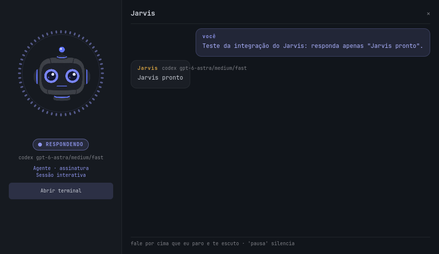

# Validação do roteamento opcional

Registro de 29/09/2026. Esta página distingue testes locais, integrações reais e serviços que não foram chamados. As opções de configuração estão no [README](../README.md).

## O que foi verificado

| Camada | Evidência | Limite |
|---|---|---|
| Agente direto | Integração real respondeu usando a assinatura configurada; nenhum classificador foi necessário. | Requer login e conectividade do CLI. |
| Codex nativo | App-server autenticado como ChatGPT, ID persistente, resposta final, Alacritty normal e continuação por teclado no mesmo ID. | Desenvolvido com CLI 0.156.1; capacidades ausentes selecionam o executor legado antes do envio. |
| Runtime instalado | Após atualizar os arquivos e reiniciar `voice-launcher.service`, o executor instalado respondeu `INSTALADO_OK`. Uma segunda reinicialização preservou o mesmo ID e a resposta anterior; o registro continha exatamente os dois pedidos enviados. | Configuração, wrapper do ambiente de voz e ícone existente foram comparados por hash e permaneceram iguais. |
| Claude nativo | Background/attach com UUID exato; sequência de três pedidos por voz no mesmo ID; respostas obtidas pelos hooks da sessão. | Desenvolvido com 2.1.280 e tmux. A entrada de voz aguarda enquanto há teclado anexado. |
| Acesso `off` | Testes reais tentaram ler arquivos temporários com conteúdos aleatórios desconhecidos dos modelos. Nenhum dos dois agentes recuperou o conteúdo. | Um modelo pode inventar uma leitura em texto; isso não significa que uma ferramenta executou. |
| Acesso `ask` | Ambos os agentes usaram o broker e só executaram o `printf` de teste depois da autorização específica. | Testes de unidade cobrem isolamento por turno, negação e cancelamento do comando. |
| Acesso `full` | Ambos leram corretamente o conteúdo aleatório de um arquivo temporário autorizado. | Mantém o alcance de acesso total do agente. |
| Cancelamento e prazo | Vigias independentes interromperam turnos nos dois agentes. No Claude, `stop` seguido de `attach` manteve o UUID e uma nova mensagem respondeu `RETOMADA_OK`, sem ferramenta adicional. | Escape sozinho foi testado e mostrou-se insuficiente no Claude em background; por isso é usado o controle nativo de parada. |
| Jev | Contrato de perguntas/respostas, decisões inválidas, falta de chave e fallback testados com respostas simuladas. | **Não executado contra a conta real:** nenhuma chave Jev configurada. |
| Respostas OpenAI | Handoff estruturado, escalada única, citações, opt-in, cancelamento e proibição de ações textuais testados. Transporte HTTP exercitado contra servidor de teste local. | **Não executado contra a API paga:** a rota estava desabilitada. Ter uma chave para STT não foi tratado como autorização. |
| Instalação | `install.sh --stage` copia os módulos e a interface para pasta isolada, sem downloads, ambientes ou serviços. Argumentos desconhecidos são rejeitados. | O teste não reinstala o ambiente de áudio da máquina. |
| Interface | QML testado para botão da sessão, rotas sem terminal e preservação do Escape do ditado; renderização inspecionada. | A imagem abaixo usa o estado de uma resposta real do executor, renderizado separadamente do microfone. |



## Classificador local: avaliação experimental

Modelo: [fastino/GLiNER2.5-multi-Decide](https://huggingface.co/fastino/GLiNER2.5-multi-Decide), revisão `a35a0cd3b7a0f00f2effc576f454cd48fa98aa5f`. Ambiente separado com GLiNER2 2.0.0 e PyTorch 2.8.0+cpu. A checagem real informou `cuda_initialized=false`.

Máquina: Intel Core i7-14700KF, 128 GB de RAM, Linux x86_64; inferência limitada a dois threads. O serviço de voz estava ativo, sem um teste simultâneo de transcrição durante a medição. A existência de uma RTX 4090 na máquina não significa que ela tenha sido usada pelo classificador.

| Medida | Resultado |
|---|---|
| Fixture | 60 pedidos em português, seis grupos de dez |
| Rota correta | **51/60 (85%)** |
| Pedido que precisava do computador encaminhado incorretamente à API | **9/60** |
| Latência p50 / p95 da política + classificação aquecida | 289,85 / 474,78 ms |
| Primeira chamada, retorno imediato ao agente | 0,46 ms |
| Carregamento do modelo em background | 10,41 s |
| Ambiente + modelo em disco | Aproximadamente 2,2 GiB, incluindo cerca de 1,1 GiB de checkpoint |
| Descarregamento por inatividade | Processo terminou com código 0 após 2,5 s em teste com prazo de 2 s |

Os números de latência incluem os casos de continuação clara que dispensam o classificador. Não são latências da resposta completa do Jarvis. Não medimos calibração de confiança, consumo de RAM isolado ou desempenho durante transcrição concorrente.

Uma primeira avaliação com categorias em inglês acertou 47/60 e cometeu sete erros computador→API. As categorias em português elevaram o total de acertos, mas aumentaram esses erros para nove. **Por isso o modo local permanece experimental, desligado por padrão e não é a recomendação para uso diário.** Ele não executa ações; uma rota incorreta pode produzir uma resposta inadequada ou sem acesso ao arquivo necessário.

Reprodução, após a instalação opcional:

```bash
python scripts/evaluate-routing.py --mode local --output /tmp/jarvis-routing.json
```

A [fixture pública](../tests/fixtures/routing_pt_br.json) registra contexto, rota esperada e necessidade de computador. O avaliador não executa agentes nem ações. `--mode agent` mede somente a política de bypass; não representa acurácia de um classificador. Sem credenciais/opt-in, Jev e assistant são registrados como **não executados**, em vez de receberem uma pontuação artificial de fallback.

O [relatório por caso](validation/local-router-2026-09-29.json) registra a rota, o resultado e a latência de cada exemplo.

## Regressões e reprodução

```bash
python -m unittest discover -s tests -v
QT_QPA_PLATFORM=offscreen /usr/lib/qt6/bin/qmltestrunner -import app -input tests
bash -n install.sh scripts/install-router-local.sh bin/jarvis
bash install.sh --stage /tmp/jarvis-runtime-stage
```

Use Qt 6; algumas distribuições reservam `qmltestrunner` sem caminho para Qt 5. Os testes de roteamento, transporte, sessões, permissões e ditado são independentes de credenciais reais.

A linha de base desta máquina já apresentava duas falhas nos testes do Picoh: `test_conversation_phases_are_all_distinct` e `test_eye_brightness_quadratic`. O comportamento de brilho/coreografia não foi alterado para fazer esses testes passarem. As falhas continuam separadas da validação do roteamento.

Resultado final no checkout principal: **203 testes Python, 201 aprovados e as duas falhas preexistentes acima**. No Qt 6, os seis casos de comportamento passaram, além dos quatro checks de inicialização/encerramento. A revisão independente encontrou três transições de cancelamento/reconciliação; as reproduções falharam antes da correção e passaram depois. O teste real de encerramento também verificou que um processo de teste resistente a SIGTERM é finalizado somente no scope da própria sessão.

## Contratos consultados

- [TypeSafe: API](https://docs.typesafe.ai/api.md) e [Choice](https://docs.typesafe.ai/primitives/choice.md).
- [Codex app-server](https://learn.chatgpt.com/docs/app-server.md), schemas gerados pelo CLI instalado e suas respostas reais.
- [OpenAI: function calling](https://developers.openai.com/api/docs/guides/function-calling) e [web search](https://developers.openai.com/api/docs/guides/tools-web-search).
- [Claude Code: hooks](https://code.claude.com/docs/en/hooks), `claude --help`, `claude attach --help` e `claude stop --help` da versão instalada.
- [GLiNER2](https://github.com/fastino-ai/GLiNER2) e o checkpoint citado acima.
